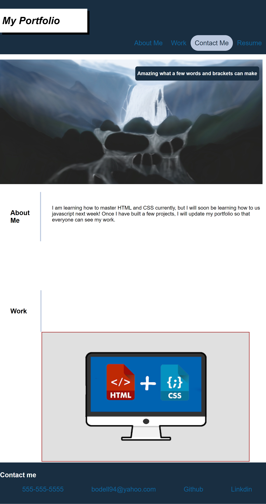

# Advanced_CSS_Portfolio_BO
Homework 2 portfolio

In this project I used HTML and CSS to create my own portfolio website. 

I added features such as hover, smooth scrolling transitions, shadows, and links to my github.

